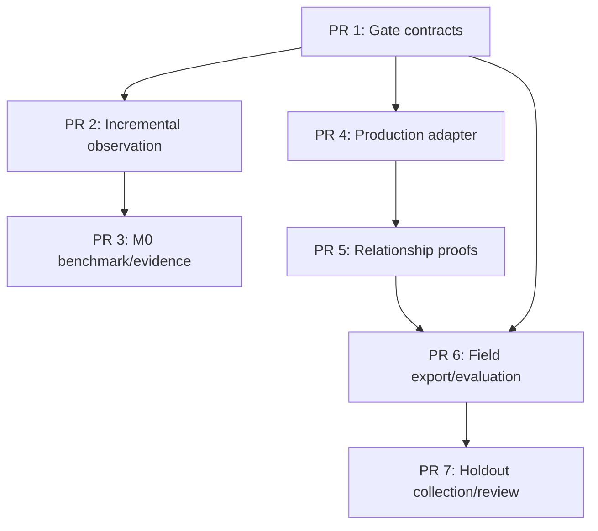

# PatchMesh Phase 2 M0/M7 Remediation Implementation Plan

Status: Ready for implementation

Source specification: `docs/superpowers/specs/PATCHMESH_PHASE2_M0_M7_REMEDIATION_SPEC.md`

Repository baseline: `793b98a510f8dfa287eb2c7c1ef9909287840c30`

Scope: Phase 2 M0 performance gate and M7 production-evidence/quality gate

Authority: Report-only. This plan must not add `delay` or `reject`, imply acceptance
of M1-M6, or declare Phase 2 complete.

## 1. Review decisions incorporated

This plan corrects and clarifies the draft in the following ways:

1. Restores the missing `PR 7 — Real holdout collection and final gate review`
   heading.
2. Makes the dependency graph explicit. PR 6 schema/dispatcher work may start after
   PR 1, but its end-to-end acceptance depends on PRs 4 and 5.
3. Clarifies PR 1's “no runtime behavior change” criterion. Production observation
   and detector behavior must not change in PR 1; gate parsing and validation behavior
   intentionally becomes stricter.
4. Adds a hard capability checkpoint before PR 4 implementation. If no named runtime
   owns synchronous around-tool execution, M7 remains blocked and post-tool hooks must
   not be relabeled as production adapters.
5. Separates mergeable benchmark code from controlled M0 evidence generation. The
   production artifact must identify the exact clean revision measured.
6. Defines verifier outcomes: malformed or untrustworthy artifacts are `rejected`;
   valid but incomplete, over-budget, dirty, failed, or unsupported evidence is
   `deferred`; only fully passing evidence is `accepted`.
7. Separates normal pull-request CI from controlled performance measurement and real
   field collection.
8. Adds explicit privacy, path-confinement, fail-closed, documentation, and status
   requirements to every relevant PR.

## 2. Global implementation invariants

Every PR in this plan must preserve these invariants:

- Deterministic ordering, timestamps, event IDs, filenames, and arrival order are not
  causal or concurrency proof.
- M0 decisions are recomputed from raw measurements generated by the canonical
  benchmark command. Supplied summaries and decisions are never authoritative.
- M0 v1 budgets are `250 / 1500 / 5000 ms` for `1,000 / 10,000 / 50,000` files.
  Changing a budget requires a new versioned definition.
- M7 observed results are generated by replaying validated protocol events through
  checked-in detector code.
- Reviewer labels and generated detector outputs remain separate artifacts.
- Only persisted, completion-linked `file.changed` events with sufficient coverage can
  become verified effects.
- Missing, invalid, ambiguous, bypassed, overlapping, or incomplete evidence fails
  closed as degraded or unavailable. It is neither a finding nor a verified negative.
- Raw runtime traces, unreviewed exports, and generated outputs are ignored by default.
- Adapters translate runtime activity; analyzers produce facts; detectors produce
  findings; policy remains report-only.
- Passing M0 and M7 does not complete Phase 2. M1-M6 retain independent exit gates.

## 3. Sequencing and merge dependencies



Merge rules:

- PR 1 merges first.
- PR 2 depends on PR 1; PR 3 depends on PR 2.
- PR 4 depends on PR 1 and begins with the capability checkpoint described below.
- PR 5 depends on a working PR 4 adapter path.
- PR 6 schema, canonicalization, and pure evaluator work may begin after PR 1.
  End-to-end PR 6 acceptance depends on PRs 4 and 5.
- PR 7 depends on PR 6 and is evidence collection/review, not detector development.
- M0 and M7 workstreams may proceed independently after PR 1.

The critical M7 path is PR 1 → PR 4 → PR 5 → PR 6 → PR 7.

## 4. PR 1 — Versioned gate contracts and schema hardening

### Goal

Give M0 and M7 one versioned source of truth and reject forged, mixed, unsafe, or
structurally invalid evidence before changing production runtime behavior.

### Deliverables

Add:

- `benchmarks/phase2/m0-workloads.v1.json`
- `benchmarks/phase2/m7-quality-gate.v1.json`
- strict definition loaders and canonical SHA-256 digest helpers
- generated M0 evidence schema and validator
- field case index v2 schema and validator
- field input v2 schema and validator
- reviewer label v2 schema and validator
- generated detector output v2 schema and validator

### Required implementation

1. Define M0 v1 with exactly:

   - metric: `incremental_interception_overhead_ms`
   - percentile: `0.95`
   - warm-up samples: `5`
   - measured samples: `30`
   - independent runs: `3`
   - small: `1,000` files, `250 ms`
   - medium: `10,000` files, `1,500 ms`
   - large: `50,000` files, `5,000 ms`
   - fixture generator version, content seed/distribution, ignore-policy version,
     network prohibition, and required environment identity

2. Define M7 v1 with:

   - exact detector list
   - minimum `30` positive and `150` negative holdouts per detector
   - precision `>= 0.95`
   - recall `>= 0.90`
   - Brier score `<= 0.10`
   - observed FPR `<= 0.02`
   - one-sided 95% Wilson FPR upper bound `<= 0.02`

3. Load definitions with exact schemas and `additionalProperties: false`.

4. Reject missing, duplicate, extra, reordered-as-duplicate, or modified tiers and
   detectors. Array order may be canonicalized, but identity duplication must never be
   hidden by canonicalization.

5. Canonicalize validated definitions, then compute `sha256:<hex>` digests from the
   canonical bytes.

6. Replace the M0 `30 / 60 / 120 ms` evaluator constant with the M0 v1 loader. Do not
   change observation, proxy, detector, or policy execution in this PR.

7. Keep semantic validation separate from JSON-schema validation. Semantic checks must
   cover:

   - exact tier and detector sets
   - safe relative paths confined to approved roots
   - no absolute paths, `..` traversal, root aliases, or symlink escape
   - digest format and digest/content equality
   - exact run/sample/count requirements
   - reviewer/generated field separation
   - `reviewerId !== collectorId` for exit-gate holdouts

### Required tests

- Missing, duplicate, extra, or modified M0 tier.
- Modified M0 budget, sample count, fixture version, or ignore-policy version.
- Missing, duplicate, extra, or modified M7 detector or threshold.
- Unknown fields at every schema nesting level.
- Bad digest syntax and valid-looking digest with mismatched content.
- Absolute, escaping, aliased, symlinked, or wrong-root field paths.
- Generated output containing expected labels or reviewer metadata.
- Reviewer labels containing generated output fields.
- Forged M0 summary, decision, failure count, or percentile fields.
- Non-finite, negative, missing, or wrong-count raw samples.

### Exit criteria

- Both gates have one versioned definition used by their loaders.
- All gate constants duplicated in evaluator code are removed.
- Strict schemas and semantic validators pass positive and negative tests.
- Production observation, detector, and authority behavior is unchanged.
- Stricter gate-validation behavior is documented as intentional.

## 5. PR 2 — Incremental observation engine

### Goal

Make steady-state observation proportional to changed candidate paths while preserving
logical equivalence with full snapshots and explicitly degrading incomplete coverage.

### Deliverables

Extend `packages/observation` with:

- `IncrementalObservationBoundary`
- `ObservationWindow`
- `ObservationWindowResult`
- per-workspace watcher sessions
- monotonic bounded event journals
- cached content state
- periodic full reconciliation
- shared versioned ignore policy
- explicit shutdown/disposal behavior

Integrate the window fast path into `McpProxy`, retaining the snapshot API as a
compatibility fallback.

### Required lifecycle

1. Start the watcher before the initial full scan.
2. Build the initial hash state once.
3. Drain and reconcile events received during initialization.
4. Flush queued out-of-band events and record a journal cursor at `beginWindow`.
5. At `endWindow`, apply a bounded quiescence barrier.
6. Drain and deduplicate candidate paths after the cursor.
7. Hash only unique candidates; represent deletions without reading missing files.
8. Produce before/after change records and update cached state atomically.
9. Keep changes between tool windows in `outOfBandChanges`.
10. Reconcile periodically with a full scan outside the timed tool critical path.

### Fail-closed behavior

The following conditions must create explicit gaps and degraded coverage:

- watcher overflow or bounded-journal loss
- unsupported recursive watching without a proven complete backend
- watcher initialization or reconciliation mismatch
- workspace root replacement or identity change
- unreadable/unhashable candidate
- unsafe or unbounded symlink behavior
- ambiguous rename pairing
- watcher shutdown during an active window
- overlapping attribution windows without host-proven exclusivity

Degraded observation may trigger a full reconciliation. It must not claim verified
attribution until completeness is re-established. A fallback scan is recovery, not a
license to erase the original gap.

### Git observation

- Cache Git common/admin directories per workspace.
- Invalidate the cache when root identity changes.
- Observe `HEAD` only at boundaries where revision identity matters.
- Limit Git blob hashing to changed candidates or explicit consumer requests.
- Remove repeated whole-tree Git subprocess work from each capture.

### Required tests

- Scan/watcher initialization race.
- Events during initialization are neither lost nor double-counted.
- Create, modify, delete, symlink, and ambiguous rename.
- One changed file rehashes only that candidate in steady state.
- Queue overflow, watcher failure, root replacement, unreadable path, and reconciliation
  mismatch degrade coverage.
- Out-of-band changes remain separate from active-window effects.
- Overlapping windows cannot both claim deterministic attribution.
- Candidate deduplication does not hide multiple relevant transitions.
- Full-snapshot and incremental paths produce equivalent logical changes.
- POSIX and Windows path normalization/confinement behavior.
- Session reuse, disposal, restart, and workspace identity invalidation.

### Exit criteria

- Steady-state work scales with candidate paths, not total workspace files.
- Initialization and periodic reconciliation close the scan/watcher gap.
- All incomplete observation modes are explicit and fail closed.
- Snapshot fallback remains compatible.
- No business or detector logic moves into the observer.

## 6. PR 3 — Canonical M0 benchmark and verifier

### Goal

Generate reproducible raw performance evidence and accept M0 only from a clean,
identified revision whose recomputed measurements pass all v1 tiers.

### Deliverables

- deterministic fixture generator defined by M0 v1
- `tools/phase2/m0-benchmark.ts`
- `tools/phase2/m0-verify.ts`
- root `phase2:m0:benchmark` command
- root `phase2:m0:verify` command
- reduced-size benchmark smoke fixtures/tests
- controlled production M0 artifact after code review/merge

### Benchmark requirements

For each tier, create a new temporary local Git repository and SQLite store with no
network dependency. Record the workload-definition digest and environment identity.

For each of three independent runs:

1. Measure cold initialization separately; it is non-gating but mandatory evidence.
2. Perform five warm-up pairs.
3. Perform thirty retained pairs.
4. For each pair:

   - execute the deterministic one-file mutation directly and record `baselineNs`;
   - restore logical pre-state outside the timed region;
   - execute the same mutation once through `McpProxy.execute` and record
     `instrumentedNs`;
   - compute `overheadNs = max(0, instrumentedNs - baselineNs)`;
   - persist any failure alongside the raw values.

Fixture creation, watcher startup, initial scan, Git setup, database setup, state
restoration, and artifact writes are outside timed sections.

The full v1 run contains 270 retained pairs and 45 warm-up pairs across the three
tiers. No raw sample may be dropped as an outlier.

### Verifier requirements

The verifier must ignore supplied `p50Ms`, `p95Ms`, `gateP95Ms`, failure counts,
acceptance flags, decisions, and reasons. It recomputes:

- p50 for each run
- nearest-rank p95 for each run
- tier gate p95 as the maximum of the three run p95 values
- failure counts
- per-tier and overall decisions

Outcome rules:

- `rejected`: schema failure, definition/digest mismatch, unsafe structure, invalid
  sample count, or non-finite/negative/mutually inconsistent timing values.
- `deferred`: structurally valid evidence that is dirty, failed, incomplete,
  over-budget, from the wrong revision/environment, or otherwise not acceptable.
- `accepted`: exact clean revision, exact definition, exact counts, zero failures, and
  all three tier gate p95 values at or below budget.

All outcomes return typed diagnostics; generic catches must not become “no result.”

### Controlled artifact workflow

1. Merge the reviewed benchmark/verifier implementation.
2. Check out the exact target revision cleanly on the controlled stable environment.
3. Run the canonical benchmark command.
4. Record the clean revision before artifact generation makes the worktree dirty.
5. Verify the produced artifact independently.
6. Commit the artifact and documentation as evidence for the measured revision.

Ordinary hosted CI may verify the artifact but must not silently replace the accepted
baseline.

### Required tests

- Reduced-size end-to-end smoke benchmark.
- Accepted fixture.
- Well-formed over-budget fixture returns `deferred`.
- Dirty, failed, incomplete, or wrong-revision fixture returns typed `deferred`.
- Bad schema/digest/count/sample fixture returns typed `rejected`.
- Forged summaries and decisions cannot affect recomputed output.
- Nearest-rank p95 and maximum-of-run p95 are correct at boundary values.
- Full and incremental observation produce equivalent fixture effects.

### Exit criteria

- Canonical commands generate and verify raw evidence.
- Controlled clean-revision artifact passes small, medium, and large tiers.
- Every tier has exact run/sample counts and zero failures.
- Recomputed gate p95 is within M0 v1 budget for every tier.
- Artifact records environment, definition digest, measured revision, and limitations.

## 7. PR 4 — First production host adapter

### Goal

Make one named production runtime own a real tool execution path, route it through
`McpProxy.execute` exactly once, and forward only persisted completion-linked evidence
to the recorder.

### Capability checkpoint

Before implementation, identify one named runtime and document whether it provides
synchronous around-tool interception.

- If it does, name the runtime/version and exact interception entrypoint in the PR.
- If it does not, stop adapter implementation, record a typed capability blocker, and
  leave M7 deferred.
- A post-tool hook may continue to collect lifecycle evidence but must not be described
  as an executor-owning production adapter.

This checkpoint is a stop condition, not a test that may be bypassed.

### Deliverables

- runtime-specific adapter under `packages/adapters`
- host entrypoint or daemon lifecycle composition
- `HostAdapterCapabilities` declaration and canonical digest
- authoritative runtime/session context construction
- persisted evidence reader keyed by terminal completion ID
- bounded redacted recorder-failure diagnostic path

### Required execution path

1. Build context only from authoritative runtime/session configuration.
2. Allow hook/tool payload identity to confirm but never override that context.
3. Persist one `tool.requested` event before executor invocation.
4. Invoke the underlying executor exactly once through `McpProxy.execute`.
5. Preserve success, failure, interruption, exit code, abort semantics, and original
   tool result.
6. Await proxy completion before evidence lookup.
7. Read the persisted request, one terminal completion, and only that completion's
   linked effects from the same event store.
8. Forward the exact proxy result and persisted events to the evidence recorder.
9. If recording fails, return the original tool result and emit only a bounded,
   redacted diagnostic.
10. Never infer effects from paths, command text, tool I/O, model claims, or hooks.

### Required tests

- Exactly one request, one executor invocation, and one terminal completion.
- Success, executor failure, interruption, abort, and non-zero exit code.
- Bypass attempt cannot produce verified evidence.
- Payload/runtime identity mismatch fails closed.
- Recorder failure does not alter execution result.
- Evidence lookup cannot mix stores, requests, completions, or tool calls.
- At least one real file-changing call produces non-empty persisted,
  completion-linked verified effects.
- Capability digest changes when capability content changes.

### Exit criteria

- A named real host tool call is synchronously wrapped exactly once.
- Request/completion/effect evidence is persisted and deterministically linked.
- Runtime identity is authoritative.
- Recorder failure is bounded and non-authoritative.
- No report-only authority change occurs.

## 8. PR 5 — Relationship-proof capture

### Goal

Produce sufficient real proofs for supported concurrency, stale-read, and exported-
contract scenarios without converting chronology or incomplete evidence into proof.

### Deliverables

- authoritative task and executor-owned tool-window lifecycle registry
- immutable integration-target snapshot binding
- same-symbol concurrency proof production
- durable observed-read token flow
- token-bound dependent-write flow
- exported-contract evidence validation
- positive and fail-closed integration tests

### Same-symbol concurrency proof

Require all of:

- distinct tasks
- distinct agents
- distinct worktrees in the same repository
- same immutable integration target
- authoritative overlapping task lifetimes or executor-owned tool windows
- referenced persisted `symbol.changed` events
- sufficient observation/proof coverage

Sequential work, process coexistence, timestamps, lexical order, event IDs, and
unrelated roots are not proof.

### Stale-read proof

The durable observed-read token must bind:

- repository
- workspace/worktree
- task
- resource
- observed version
- read event ID
- integration-target snapshot

A dependent write must explicitly present that token or an equivalent structured host
relationship. The candidate changed event and completion-linked write effect must both
be persisted with sufficient coverage. Cross-task, cross-target, unrelated-resource,
missing-token, and unlinked-write cases fail closed.

### Exported-contract proof

Require:

- candidate exported contract change
- hash-bound source analysis
- exactly one sufficient derived-evidence record per target
- resolver-confirmed consumer dependency
- matching immutable integration target
- non-ambiguous analyzer and resolver evidence

### Required tests

- Real positive scenario for each supported proof type.
- Sequential, same-agent, same-worktree, different-target, and different-symbol overlap
  cases.
- Missing/conflicting lifecycle and concurrency assertions.
- Missing, cross-task, cross-target, unrelated, current, or conflicting read tokens.
- Dependent write without completion-linked persisted write effect.
- Parameter rename, compatible signature, non-exported symbol, unrelated consumer,
  ambiguous derived evidence, and insufficient coverage.
- Duplicate or conflicting proofs fail closed deterministically.

### Exit criteria

- Supported real scenarios produce sufficient proofs.
- Unsupported or ambiguous cases remain degraded/unavailable.
- No degraded case can become a finding or a verified negative.
- No deterministic tie-break or timestamp is treated as causality/concurrency.

## 9. PR 6 — Field exporter and deterministic evaluator

### Goal

Make M7 results reproducible from checked-in protocol events so copied corpus fields or
hand-authored outputs cannot satisfy the gate.

### Artifact layout

```text
.evidence/
  config.json
  schema/
  fixtures/
  runtime/                     # ignored
  corpus/field-v2/
    inputs/<case-id>.json
    labels/<case-id>.json
    corpus.json
  field-output/                # ignored
  reports/                     # commit only accepted reviewed reports
```

Ignore raw runtime traces, generated outputs, locks/state, and unreviewed exports.

### Exporter requirements

Implement a deterministic SQLite exporter that:

1. Selects the transitive causal/reference closure needed by the declared target.
2. Validates protocol events, reference completeness, and replay.
3. Minimizes and canonicalizes the event slice.
4. Enforces approved-root path confinement and rejects symlink/path escape.
5. Redacts before writing and performs a final redaction scan.
6. Excludes prompts, hidden reasoning, secrets, full environment maps, and raw tool
   output.
7. Computes canonical content digests.
8. Records adapter/runtime version and capability digest.
9. Writes unreviewed exports outside the committed corpus.
10. Requires an explicit promotion/review step before a case may enter `corpus/field-v2`.

### Evaluator requirements

Implement a pure detector dispatcher using public derivation and detector functions.
For each case:

1. Validate the case index and input schema/path confinement.
2. Validate the protocol events and complete reference set.
3. Replay the event set; invalid replay is `unavailable`, not negative.
4. Run the declared detector from the replayed events.
5. Match only findings for the declared target resource/task.
6. Generate `observedFinding`, `predictedProbability`, matching IDs, detector version,
   code revision, diagnostics, and finding digest from actual output.
7. Write canonical generated output.
8. Load the separate reviewer label only after detector execution.
9. Compute precision, recall, Brier score, observed FPR, and one-sided 95% Wilson FPR
   upper bound.
10. Keep degraded/unavailable cases in a coverage report and outside quality scoring.

No corpus field may override an observed result, probability, finding ID, detector
version, code revision, diagnostic, or digest.

### Determinism requirements

- Canonical input, duplicates, and every valid out-of-order variant must produce
  equivalent findings.
- Invalid variants return typed diagnostics.
- For minimized fixtures, enumerate all valid topological orderings.
- If exhaustive enumeration exceeds an explicit safety bound, the case remains
  deferred; the evaluator must not silently sample and claim full equivalence.

### Commands

Add:

- `phase2:m7:export`
- `phase2:m7:evaluate`
- combined `phase2:gates`

### Required tests

- Export closure is complete and minimal.
- Canonical export is stable across raw arrival order.
- Duplicate protocol-event-set digest is rejected.
- Unsafe path or redaction violation blocks export/promotion.
- Hand-authored output, copied corpus result, or mixed label/output fails.
- Label changes cannot alter detector execution.
- Generated output changes only with detector/input/code changes.
- Canonical, duplicate, and all bounded valid out-of-order variants agree.
- Invalid replay and degraded proof are not scored as negatives.
- Metric and Wilson calculations pass boundary-value tests.

### Exit criteria

- Detector results are reproduced from checked-in protocol events.
- Reviewer labels remain separate and load only after execution.
- Generated outcomes and metrics cannot be supplied by corpus authors.
- Invalid/degraded cases remain visible but unscored.
- Export, redaction, path, digest, and promotion boundaries fail closed.

## 10. PR 7 — Real holdout collection and final gate review

### Goal

Collect and independently review sufficient real production-adapter evidence, then
accept M7 only when every versioned count, quality, capability, and scenario condition
passes.

### Collection workflow

1. Run every required scenario-matrix row through the production adapter.
2. Use temporary repositories and real linked worktrees.
3. Do not synthesize PatchMesh effects or insert detector events manually.
4. Export from SQLite, minimize, validate, redact, and stage candidate cases outside
   the committed corpus.
5. Assign an independent reviewer per case; `reviewerId` must differ from
   `collectorId`.
6. Keep reviewers blind to detector output until labels are finalized.
7. Freeze label content/digests before detector evaluation.
8. Promote only reviewed cases into the committed field-v2 corpus.
9. Run the deterministic evaluator and record exact generated results.

### Required scenario coverage

Per detector, collect at least:

- 30 positive holdout cases
- 150 negative holdout cases
- multiple repository domains or materially distinct scenario families
- no duplicate protocol-event-set digest
- no trivially renamed copies across training and holdout sets
- sufficient coverage for every quality-scored case

For the three specified detectors, the structural minimum is 540 scored cases: 90
positive and 450 negative. Degraded/unavailable cases are additional coverage evidence
and do not count toward these totals.

Required scenario families:

| Detector | Positive | Negative/degraded |
| --- | --- | --- |
| Same-symbol overlap | Distinct agents/tasks/worktrees, same symbol/target, proven overlap | Sequential; same agent; same worktree; different target/symbol; missing/conflicting lifecycle |
| Stale read before write | Durable v1 token, sufficiently observed v2, token-bound dependent write | Current comparison; unrelated resource; missing/cross-task/cross-target token; degraded coverage; unlinked write |
| Exported-contract invalidation | Breaking exported change and resolver-confirmed consumer on same target | Parameter rename; non-exported/compatible change; unrelated consumer; different target; ambiguous/insufficient derived evidence |

### Acceptance thresholds

Each detector independently must satisfy:

- precision `>= 0.95`
- recall `>= 0.90`
- Brier score `<= 0.10`
- observed FPR `<= 0.02`
- one-sided 95% Wilson FPR upper bound `<= 0.02`

No aggregate metric may hide a failing detector.

### Exit criteria

- One named production adapter and required capabilities are proven.
- Real parent/subagent lifecycle and non-empty verified effects exist.
- Required concurrency and stale-comparison proofs exist for supported capabilities.
- Exact holdout counts and scenario diversity pass per detector.
- Independent frozen labels are separate from generated outputs.
- Every versioned metric passes per detector.
- Environment, revision, commands, counts, metrics, limitations, and decision are
  recorded.
- If any count, capability, scenario, or threshold fails, M7 remains `deferred` and
  report-only.

## 11. CI and controlled evidence workflows

### Normal pull-request CI

Run:

- build
- typecheck
- full workspace tests
- Phase 0 validation/tests
- evidence tests and trace validation
- M0/M7 schema and evaluator tests
- deterministic replay of committed reviewed field cases
- `git diff --check`

Normal CI verifies code and checked-in artifacts. It does not create authoritative M0
performance evidence or M7 field evidence.

### Controlled M0 workflow

- Runs on a stable, identified environment.
- Starts from a clean exact revision.
- Generates all raw timing samples.
- Produces an artifact for independent verification and review.
- Does not auto-update accepted baselines from ordinary CI.

### Explicit M7 field-collection workflow

- Requires the selected production host adapter.
- Runs real scenario collection separately from CI regression fixtures.
- Stages unreviewed material outside the committed corpus.
- Requires redaction and independent review before promotion.

## 12. Final verification

Run from a clean checkout:

```sh
corepack pnpm install --frozen-lockfile
corepack pnpm build
corepack pnpm typecheck
corepack pnpm test
node tools/phase0/validate.mjs
node --test tools/phase0/*.test.mjs
corepack pnpm evidence:test
corepack pnpm evidence:validate
corepack pnpm phase2:m0:verify
corepack pnpm phase2:m7:evaluate
git diff --check
git status --short
```

Use an unquoted shell glob for the Phase 0 tests unless the repository provides a root
script that enumerates them. A quoted glob may be passed literally by the shell.

Required final state:

- Every command exits successfully.
- `git diff --check` is clean.
- `git status --short` is empty.
- The final report records exact revision, environment, commands, sample counts, case
  counts, recomputed metrics, gate decisions, and known limitations.
- M0 and M7 decisions remain separate.
- Authority remains report-only.
- Documentation states Phase 2 is partial until every M1-M7 exit gate is independently
  closed.

## 13. Explicit non-goals

This plan does not include:

- automatic revalidation
- `delay` or `reject` enforcement
- a second runtime adapter
- network transport
- signing/authentication infrastructure
- sandboxing
- semantic detector authority
- dashboard work
- declaring M1-M6 accepted
- declaring Phase 2 complete solely because M0 and M7 pass

## 14. Overall definition of done

The remediation is complete only when:

1. PRs 1-7 satisfy their individual exit criteria.
2. M0 is accepted from recomputed raw evidence for a clean exact revision.
3. M7 is accepted from real production-adapter evidence and independent reviewed
   holdouts.
4. All final verification commands pass from a clean checkout.
5. No evidence is fabricated, inferred from untrusted tool payloads, or promoted
   without validation/redaction/review.
6. PatchMesh remains report-only.
7. Project documentation does not overstate Phase 2 completion.
